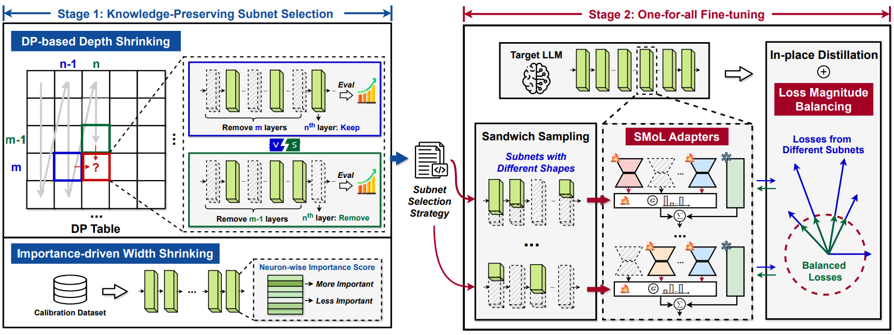
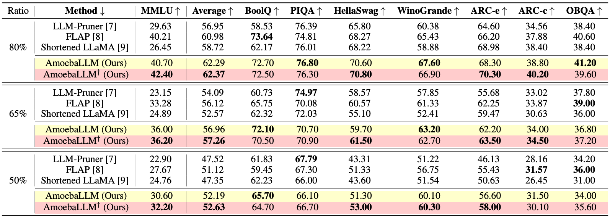

# AmoebaLLM: Constructing Any-Shape Large Language Models for Efficient and Instant Deployment
Yonggan Fu, Zhongzhi Yu, Junwei Li, Jiayi Qian, Yongan Zhang, Xiangchi Yuan, Dachuan Shi, Roman Yakunin, and Yingyan (Celine) Lin

Accepted at NeurIPS 2024 [[Paper](https://arxiv.org/pdf/2411.10606) | [Slide](https://drive.google.com/file/d/1QiF2Suh7lf-NJ6b6SBwju3AnvEfjWD8L/view?usp=sharing)].


## AmoebaLLM: Overview
- **How to Train Once and Derive Many Efficient LLMs?** We introduce AmoebaLLM, a novel framework designed to instantly derive LLM subnets of arbitrary shapes, which achieve the accuracy-efficiency frontier and can be extracted after merely a one-time fine-tuning. In this way, AmoebaLLM facilitates rapid deployment tailored to different platforms and application-driven specifications. Specifically, AmoebaLLM achieves this goal by strategically extracting high-performing subnets and training them jointly to avoid conflicts.

<p align="center">
  
</p>


- **Experimental Results:** AmoebaLLM not only sets new standards in LLM adaptability but also successfully delivers subnets that achieve SOTA trade-offs between accuracy and efficiency.

<p align="center">
  
</p>


## Code Usage


### Environment Setup

Use *conda* to setup the environment based on the provided `env.yml`:

```
conda env create -f env.yml
```

### Stage 1: Knowledge-preserving subset selection

- *Step 1*: Derive layer selection strategy using dynamic programing:

```
CUDA_VISIBLE_DEVICES=0 python main.py --model_name_or_path meta-llama/Llama-2-7b-hf --fp16 --output_dir ./output/calib_dp --do_train False --do_eval False --no_eval_orig --layer_calib_dp --calib_dataset mmlu --enable_shrinking --num_calib_sample 40 --calib_metric acc --min_num_layer 20 --dp_keep_last_layer 1
```

- *Step 2*: Derive neuron (width) selection strategy using the importance metric in [FLAP](https://github.com/CASIA-IVA-Lab/FLAP):

```
CUDA_VISIBLE_DEVICES=0 python main.py --model_name_or_path meta-llama/Llama-2-7b-hf --fp16 --output_dir ./output/width_calib --do_train False --do_eval False --use_auth_token --no_eval_orig --width_calib --num_calib_sample 512 --prune_width_method flap
```

- *Step 3*: Merge the layer and neuron selection strategy into the same file `dp_selection_strategy.npy` (we have also provided this file for LLaMA2-7B in the repo):


```
python utils/merge_depth_width.py
```


### Stage 2: One-for-all fine-tuning 

- Enable one-for-all fine-tuning using `--do_train True` and `--enable_shrinking`, and specify the subset selection strategy provided by Stage 1 with `--shrinking_file dp_selection_strategy.npy`:
  
```
CUDA_VISIBLE_DEVICES=0 python main.py --model_name_or_path meta-llama/Llama-2-7b-hf --output_dir ./output/ft --dataset alpaca-gpt4 --use_auth_token --do_train True --do_eval True --do_mmlu_eval True --do_eval_wikitext2 True --lora_modules all --fp16 --source_max_len 384 --target_max_len 128 --gradient_accumulation_steps 4 --logging_steps 10 --max_steps 10000 --save_strategy steps --data_seed 42 --save_steps 1000 --save_total_limit 1 --evaluation_strategy steps --eval_dataset_size 1024  --max_eval_samples 1000 --eval_steps 1000 --optim paged_adamw_32bit --ddp_find_unused_parameters --enable_shrinking --kd_weight 1 --min_num_layer 20 --random_sample_num_layer 2 --distill_method sp --shrinking_method calib_dp --shrinking_file dp_selection_strategy.npy --shrinkable_width --width_choice [1,7/8,3/4,5/8] --prune_width_method flap --use_moe_lora --moe_num_expert 5 --moe_topk 2
```

CUDA_VISIBLE_DEVICES=0 python main.py --model_name_or_path meta-llama/Meta-Llama-3.1-8B --output_dir ./output/ft --dataset alpaca-gpt4 --use_auth_token --do_train True --do_eval True --do_mmlu_eval True --do_eval_wikitext2 True --lora_modules all --fp16 --source_max_len 384 --target_max_len 128 --gradient_accumulation_steps 4 --logging_steps 10 --max_steps 10000 --save_strategy steps --data_seed 42 --save_steps 1000 --save_total_limit 1 --evaluation_strategy steps --eval_dataset_size 1024  --max_eval_samples 1000 --eval_steps 1000 --optim paged_adamw_32bit --ddp_find_unused_parameters --enable_shrinking --kd_weight 1 --min_num_layer 20 --random_sample_num_layer 2 --distill_method sp --shrinking_method calib_dp --shrinking_file dp_selection_strategy.npy 
### Evaluation

- In addition to your fine-tuned model created using the two-stage process described above, we have also provided our AmoebaLLM fine-tuned LLaMA2-7B model, `amoeba_llama2`, [here](https://drive.google.com/file/d/1lwOiQa-UOYOXn72wo5gvzUvFat_PTg6b/view?usp=sharing). You can download and unzip it using the following command:

```
pip install gdown
gdown 1lwOiQa-UOYOXn72wo5gvzUvFat_PTg6b
unzip amoeba_llama2.zip
```

- Specify `--output_dir` as the path to the fine-tuned model and specify the target depth and width ratios using `--eval_num_layer` and `--eval_num_width`, respectively:

```
CUDA_VISIBLE_DEVICES=0 python main.py --model_name_or_path meta-llama/Llama-2-7b-hf --output_dir amoeba_llama2 --do_train False --do_eval True --do_mmlu_eval True --bits 8 --bf16 --enable_shrinking --min_num_layer 20 --shrinking_method calib_dp --shrinking_file dp_selection_strategy.npy --shrinkable_width --width_choice [1,7/8,3/4,5/8] --prune_width_method flap --use_moe_lora --moe_num_expert 5 --moe_topk 2  --eval_num_layer 24 --eval_num_width 0.875 --do_lm_eval True --do_lm_eval_task arc_easy,piqa,hellaswag
```

## Acknowledgment

We refer to the implementations in [qlora](https://github.com/artidoro/qlora).


## Citation

```
@inproceedings{fuamoeballm,
  title={AmoebaLLM: Constructing Any-Shape Large Language Models for Efficient and Instant Deployment},
  author={Fu, Yonggan and Yu, Zhongzhi and Li, Junwei and Qian, Jiayi and Zhang, Yongan and Yuan, Xiangchi and Shi, Dachuan and Yakunin, Roman and Lin, Yingyan Celine},
  booktitle={The Thirty-eighth Annual Conference on Neural Information Processing Systems}
}
```
